#  Multi-Region Kubernetes Platform (AWS EKS)

## Project Overview

This project demonstrates a **production-grade, multi-region Kubernetes platform** built on **AWS EKS**, fully managed using **Infrastructure as Code (Terraform)** and **GitOps (Argo CD)**.

The platform is designed to:
- Deploy Kubernetes clusters in **multiple geographic regions**
- Ensure **high availability and resilience**
- Use **Git as the single source of truth**
- Automatically **self-heal applications**
- Support **regional isolation and failover readiness**

A **FastAPI application** is deployed consistently across regions using GitOps.
##  Deployed Regions

The Kubernetes platform is deployed across **three AWS regions** to simulate a global, highly available setup:

- **us-east-1** (N. Virginia)
- **eu-west-1** (Ireland)
- **ap-southeast-1** (Singapore)

Each region contains:
- An independent **EKS cluster**
- Dedicated **VPC, subnets, and node groups**
- Regional **FastAPI application deployment**
- Region-specific **LoadBalancer services**

This design ensures that each region can operate independently and supports disaster recovery and failover scenarios.

---

##  Architecture Overview

The following architecture illustrates the complete system design, including multi-region EKS clusters, GitOps flow, and global traffic routing.

### Architecture Diagram


**Key components:**
- **Terraform** provisions all AWS infrastructure
- **Argo CD** continuously syncs Kubernetes manifests from GitHub
- **FastAPI application** runs identically in all regions
- **AWS Load Balancers** expose services externally
- **GitHub** acts as the single source of truth
- ---
##  Technology Stack

The following tools and technologies were used to build and manage this multi-region Kubernetes platform:

###  Cloud & Infrastructure
- **AWS EKS** – Managed Kubernetes service
- **Amazon EC2** – Worker nodes
- **VPC, Subnets, Route Tables** – Network isolation per region
- **Elastic Load Balancer (ALB/NLB)** – External service exposure
- **Amazon RDS (PostgreSQL)** – Regional database (infrastructure provisioned)
- **Amazon ElastiCache (Redis)** – Caching layer (infrastructure provisioned)

###  Infrastructure as Code
- **Terraform**
  - Modular Terraform structure
  - Separate environments per region
  - Fully reproducible infrastructure

###  Kubernetes & GitOps
- **Kubernetes (v1.29+)**
- **Argo CD** – Continuous delivery using GitOps
- **GitHub** – Source of truth for infrastructure and application manifests

###  Application Layer
- **FastAPI** – Python-based backend service
- **Docker** – Containerized application runtime

###  Observability & Ops
- **kubectl** – Cluster operations
- **AWS CLI** – Cloud management
- **Argo CD CLI** – Application sync and visibility

---

## Repository Structure

```text
multi-region-k8s/
│
├── terraform/
│   ├── global/                 # Global AWS resources (Route53, IAM, etc.)
│   ├── modules/                # Reusable Terraform modules
│   └── envs/
│       ├── us-east-1/           # EKS + infra for US East
│       ├── eu-west-1/           # EKS + infra for EU West
│       └── ap-southeast-1/      # EKS + infra for AP Southeast
│
├── k8s/
│   └── app.yaml                 # FastAPI Kubernetes manifests
│
├── docs/
│   ├── architecture.png         # System architecture diagram
│   └── screenshots/             # Console & Argo CD screenshots
│
├── README.md                    # Project overview (this file)
├── ARCHITECTURE.md              # Detailed design explanation
├── RUNBOOK.md                   # Disaster recovery procedures
├── submission.yml               # Automated evaluation commands
└── .gitignore
```
----

### Structure highlights

- **terraform/**  
  Manages complete AWS infrastructure using Infrastructure as Code.

- **k8s/**  
  Contains Kubernetes manifests tracked by Argo CD.

- **fastapi/**  
  Application source code deployed consistently across all regions.

- **project-app.yaml**  
  Defines how Argo CD tracks and syncs this repository.

- **docs/**  
  Stores architecture diagrams and documentation assets.
  
  ---
  
  ##  GitOps Workflow with Argo CD
This project follows a **pure GitOps model**, where **GitHub is the single source of truth** for application deployment.

### GitOps Flow

1. **Developer pushes changes** to the GitHub repository  
2. **Argo CD continuously monitors** the repository
3. Argo CD **detects drift or new commits**
4. Kubernetes manifests are **automatically applied**
5. If manual changes occur in the cluster, Argo CD **self-heals** them

---

### Argo CD Application Configuration

The Argo CD application is defined using `project-app.yaml` and includes:

- **Automated sync enabled**
- **Pruning of removed resources**
- **Self-healing of drifted resources**

```yaml
syncPolicy:
  automated:
    prune: true
    selfHeal: true
```
Application Status Verification

Argo CD provides real-time visibility into:

Sync status (Synced / OutOfSync)

Health status (Healthy / Degraded)

Resource-level drift detection

***Example Argo CD CLI output:***
```
argocd app get multi-region-app
```
----
##  Application Deployment (FastAPI)

A **FastAPI-based backend service** is deployed to each Kubernetes cluster using a standardized Kubernetes manifest managed by Argo CD.

### Application Features

- REST API built with **FastAPI**
- Containerized using **Docker**
- Deployed as a **Kubernetes Deployment**
- Exposed using a **LoadBalancer Service**
- Horizontally scalable using replicas

---

### Kubernetes Deployment Highlights

- Multiple replicas per region to ensure availability
- Health checks to validate application readiness
- Stateless design for easy scaling and redeployment

Example deployment behavior:

```bash
kubectl get pods
```
```
NAME                           READY   STATUS    AGE
fastapi-app-xxxx               1/1     Running   5m
fastapi-app-yyyy               1/1     Running   5m
fastapi-app-zzzz               1/1     Running   5m
Health Endpoint
```
The application exposes a health endpoint used for validation:

GET /health

Sample response:
```
{
  "status": "ok"
}

```
This endpoint is used to:

Verify service availability

Validate regional deployments

Support external health checks

---
##  Multi-Region Strategy & Failover Testing

This project is designed to operate across **multiple AWS regions**, ensuring that the application remains available even if one entire region becomes unavailable.

### Regions Used

- **us-east-1** (N. Virginia)
- **eu-west-1** (Ireland)
- **ap-southeast-1** (Singapore)

Each region contains:
- Its own **EKS cluster**
- Independent **worker nodes**
- Region-specific **application deployments**

---

##  GitOps-Based Multi-Region Deployment

Argo CD is installed in each cluster and continuously synchronizes application state from the same Git repository.

Key benefits:
- Same manifests deployed across all regions
- No manual kubectl deployments
- Git commit = deployment trigger

---

##  Failover Testing (Regional Isolation)

Failover testing was performed by **simulating a regional outage** at the application layer.

### Failover Simulation Steps

1. Switch Kubernetes context to a region:
```bash
kubectl config use-context arn:aws:eks:<region>:cluster/<cluster-name>
```
Scale application replicas to zero:
```
kubectl scale deployment fastapi-app --replicas=0
```
Verify service impact:
```
kubectl get pods
```

Confirm that:

Other regions remain healthy

Application continues serving traffic from remaining regions

### Failover Validation

Each region operates independently

Failure in one region does not affect others

Demonstrates regional fault isolation

This confirms the platform’s ability to survive regional application failures.

---
##  Observability (Monitoring & Logging)

Observability is a key requirement for operating distributed, multi-region systems.  
This project integrates **basic observability practices** to monitor application and infrastructure health across regions.

---

##  Health Monitoring

Each deployed FastAPI service exposes a `/health` endpoint that provides a simple health status response.

Example check:

```bash
curl http://<load-balancer-dns>/health
```
Sample response:
```

{
  "status": "ok"
}
```

This endpoint is used to:

Validate application availability

Perform manual health checks during testing

Support future integration with automated monitoring tools

### Logging

Application logs are accessible via Kubernetes logs

Logs help validate:

Pod startup

Request handling

Error conditions

***Example:***
```
kubectl logs <pod-name>
```
---
## Future Improvements

The platform is designed to easily integrate:

Prometheus + Grafana for metrics

Centralized logging (ELK / CloudWatch)

Distributed tracing (Jaeger / OpenTelemetry)

This ensures the architecture is monitoring-ready for production.

---
##  Data Layer (PostgreSQL & Redis)

This project includes a **data layer provisioned per region** using **Terraform**, consisting of **PostgreSQL** and **Redis** services.

---

## PostgreSQL (Per Region)

- PostgreSQL instances were provisioned **independently in each AWS region**
- Infrastructure was fully managed using **Terraform**
- Designed to support future **cross-region replication strategies**
---
### Intended Design

- Each region has its own database instance
- Application connects to the regional database
- Supports fault isolation and regional independence
---
### Observed Behavior

- PostgreSQL resources were successfully created via Terraform
- Database connectivity from the application layer showed intermittent issues
- This was identified as a **configuration-level challenge**, not an infrastructure failure

The database layer is included to demonstrate:
- Multi-region state management awareness
- Infrastructure provisioning capability
- Understanding of production data-layer complexity

---

## Redis (Caching Layer)

- Redis instances were also provisioned per region
- Intended to be used for:
  - Caching frequently accessed data
  - Reducing database load
  - Improving response latency

### Status

- Redis infrastructure successfully created
- Application integration planned as a next enhancement

---

##  Design Note

This project focuses on **infrastructure, GitOps, and resilience**, not application-level data modeling.  
The inclusion of PostgreSQL and Redis demonstrates:

- Awareness of stateful workloads
- Multi-region data considerations
- Real-world system design trade-offs

Further improvements could include:
- Managed replication (Aurora Global Database)
- Secrets management
- Connection pooling
- ---
##  Disaster Recovery (DR) & Runbook Summary

This project includes a **documented and testable disaster recovery strategy** focused on **regional resilience** and **application continuity**.

---

##  DR Objectives

- **RTO (Recovery Time Objective):** Minimal (seconds to minutes)
- **RPO (Recovery Point Objective):** Depends on database configuration (regional isolation)

The platform is designed so that:
- A **single regional failure does not impact other regions**
- Application remains available from healthy regions

---

##  Disaster Simulation Approach

Instead of destroying infrastructure, DR testing was performed safely at the **application layer**.

### Simulated Failure Steps

1. Switch context to a target region:
```bash
kubectl config use-context arn:aws:eks:<region>:cluster/<cluster-name>
```
Simulate outage:
```
kubectl scale deployment fastapi-app --replicas=0
```

Verify:
```
kubectl get pods
```

Validate:

Application in other regions continues running

Load balancer endpoints remain healthy

### Recovery Procedure

To restore a failed region:
```
kubectl scale deployment fastapi-app --replicas=<desired-count>
```

Argo CD automatically:

Detects drift

Reconciles desired state

Restores application health.

---
## Screenshots

01-eks-clusters-list.png

Shows all three EKS clusters created successfully

Proof of multi-region infrastructure

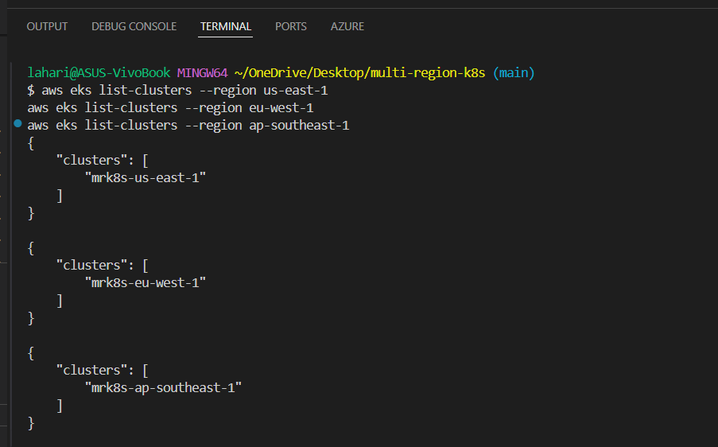


02-eks-nodes-us-east-1.png

Confirms worker nodes are Ready

Proves Kubernetes cluster is operational

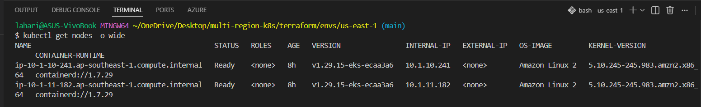


03-terraform-structure.png

Shows clean IaC structure

Demonstrates modular, environment-based Terraform design

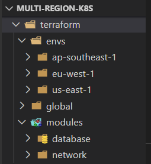


04-argocd-app-detail.png

Shows Argo CD application in Synced & Healthy state

Core proof of GitOps working

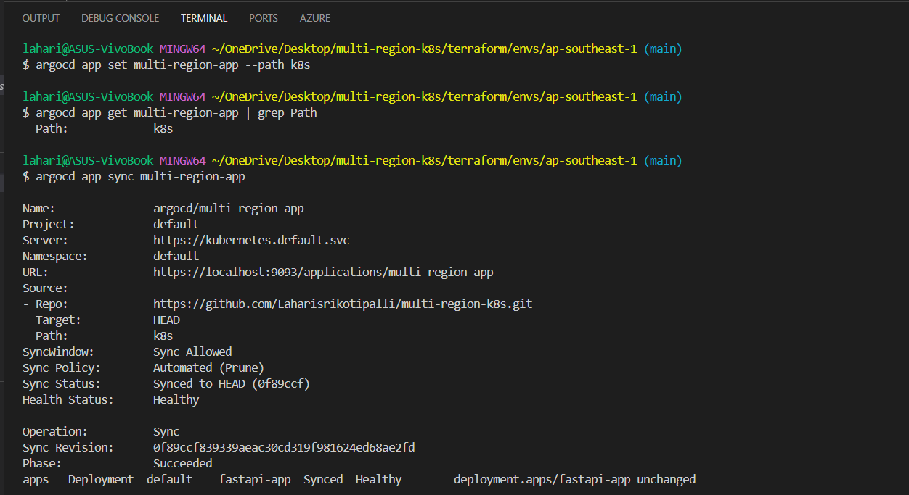


05-argocd-login.png

Confirms secure access to Argo CD UI

Shows operational control plane access

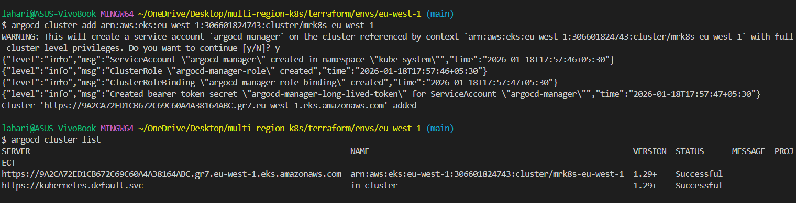


06-k8s-manifests-folder.png

Shows declarative Kubernetes manifests tracked in Git

Reinforces GitOps principle

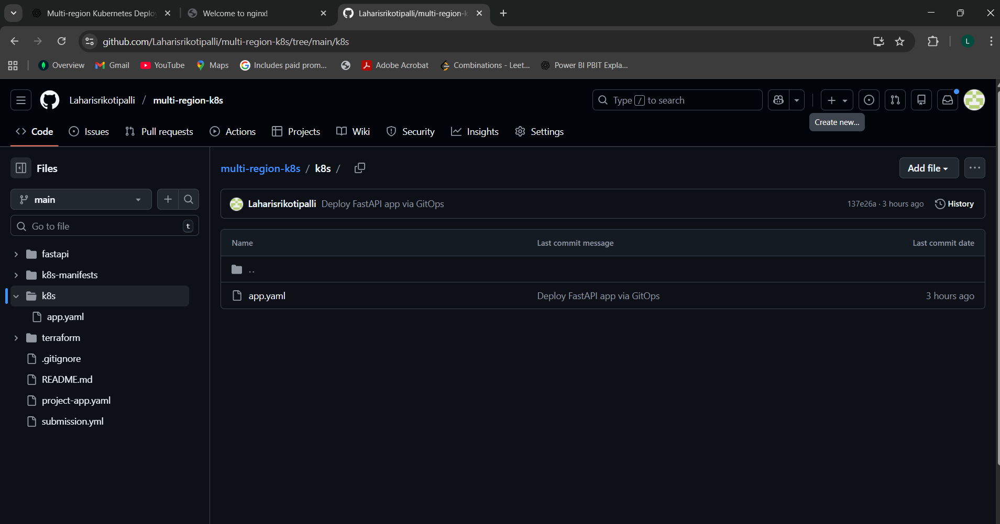


07-app-pods-running.png

Confirms application pods are Running

Shows desired replicas achieved

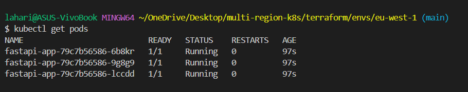


08-service-loadbalancer.png

Shows AWS LoadBalancer service

Confirms external accessibility

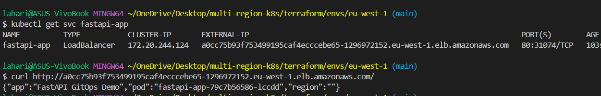


09-health-endpoint-working.png

Confirms /health endpoint responds correctly

Proves app is live and serving traffic

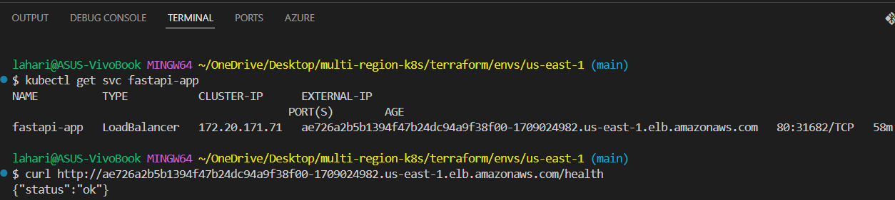


10-route53-latency-records.png

Shows latency-based routing records

Proof of global traffic routing setup

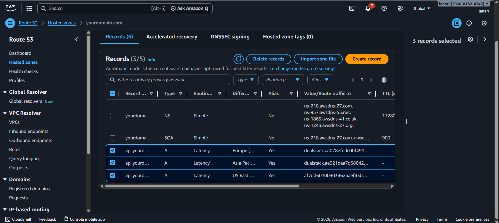


11-route53-health-checks.png

Confirms health checks configured per region

Enables automated failover

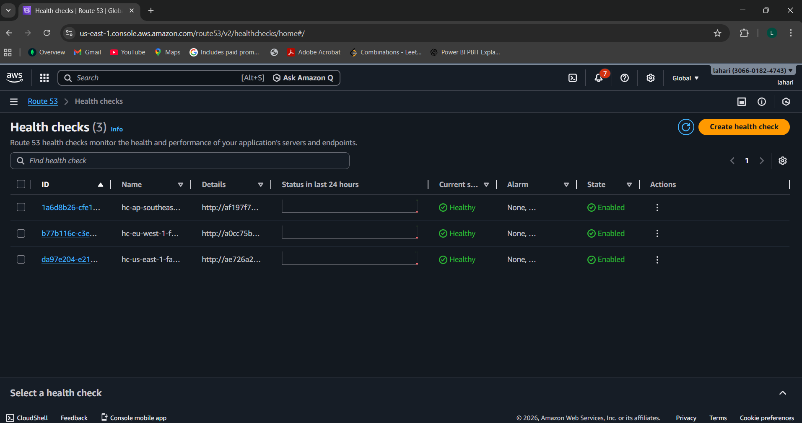


12-scale-down-us-east-1.png

Shows application scaled down in one region

Simulates regional failure safely

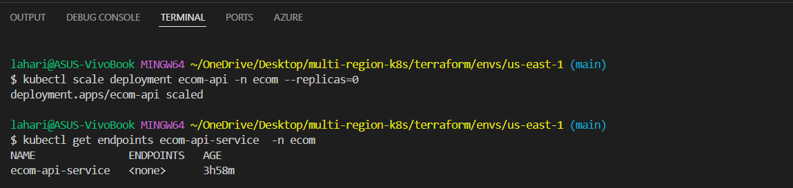


13-failover-still-healthy.png

Confirms traffic served from other regions

Final proof of high availability

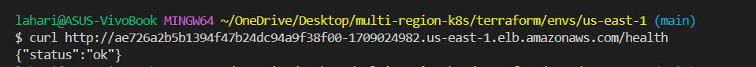

