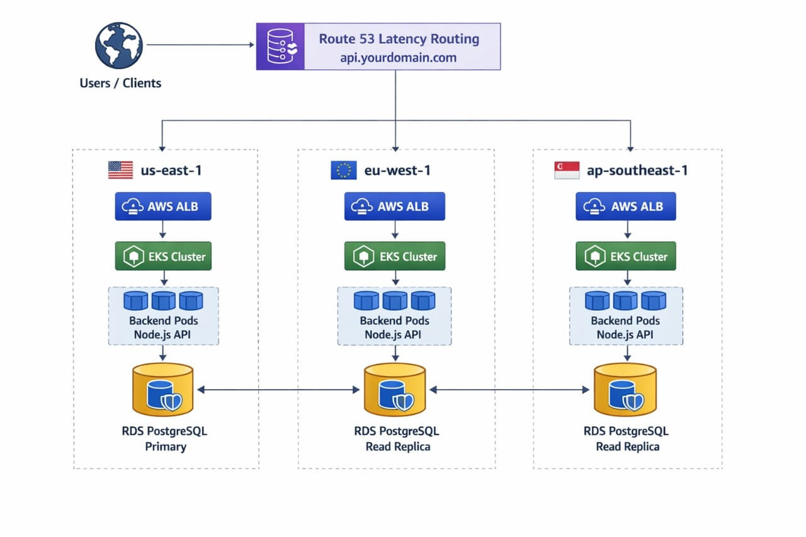

Multi-Region Kubernetes Platform using GitOps (AWS EKS)
📌 Project Overview

This project demonstrates a production-grade, multi-region Kubernetes platform built on AWS EKS, fully managed using Infrastructure as Code (Terraform) and GitOps (Argo CD).

The platform is designed to:

Deploy Kubernetes clusters in multiple geographic regions

Ensure high availability and resilience

Use Git as the single source of truth

Automatically self-heal applications

Support regional isolation and failover readiness

A FastAPI application is deployed consistently across regions using GitOps.

🌐 Regions Used
Region	AWS Code
United States	us-east-1
Europe	eu-west-1
Asia Pacific	ap-southeast-1

Each region is provisioned independently with:

VPC & networking

EKS cluster

Worker nodes

PostgreSQL (RDS)

Redis (ElastiCache)

Load Balancer

🧱 Architecture Diagram

The architecture diagram is stored inside the repository and rendered using a relative path.

Architecture Highlights

Independent EKS clusters per region

Terraform modules for reusability

Argo CD manages application state

Stateless FastAPI application

Regional databases and caches

🧰 Technology Stack

Cloud Provider: AWS

IaC: Terraform

Kubernetes: Amazon EKS

GitOps: Argo CD

Application: FastAPI (Python)

Database: PostgreSQL (RDS – per region)

Cache: Redis (ElastiCache – per region)

Container Runtime: Docker

📁 Repository Structure
multi-region-k8s/
├── fastapi/                  # FastAPI application
│   ├── main.py
│   └── Dockerfile
│
├── k8s/                      # Kubernetes manifests (GitOps source)
│   └── app.yaml
│
├── terraform/                # Infrastructure as Code
│   ├── envs/
│   │   ├── us-east-1/
│   │   ├── eu-west-1/
│   │   └── ap-southeast-1/
│   ├── global/
│   └── modules/
│       ├── network/
│       └── database/
│
├── docs/
│   └── architecture.png
│
├── screenshots/              # Proof screenshots
│   ├── 01-argocd-synced.png
│   ├── 02-pods-running.png
│   ├── 03-loadbalancer.png
│   └── 04-gitops-selfheal.png
│
├── project-app.yaml          # Argo CD Application definition
├── submission.yml            # Automated evaluation config
├── README.md
└── .gitignore

🚀 Infrastructure Provisioning (Terraform)

Terraform is used to provision all AWS resources.

Example: Deploy US East Cluster
cd terraform/envs/us-east-1
terraform init
terraform apply -auto-approve

Repeat the same steps for:

eu-west-1

ap-southeast-1

✔ All infrastructure is reproducible and version-controlled.

🔄 GitOps with Argo CD

Argo CD continuously syncs Kubernetes clusters with this Git repository.

Argo CD Application

Defined in:

project-app.yaml

Key properties:

Git repository as source

Path: k8s/

Automated sync enabled

Self-healing enabled

Any change to Git is automatically applied to clusters.

📦 Application Deployment

FastAPI application containerized using Docker

Deployed via Kubernetes Deployment

Exposed using Service (LoadBalancer)

Separate endpoints per region

Health Check Example
curl http://<loadbalancer-dns>/health

Sample response:

{
  "app": "FastAPI GitOps Demo",
  "pod": "fastapi-app-xxxxx",
  "region": "us-east-1"
}

🖼️ Screenshots (Evidence)
1️⃣ Argo CD Application – Synced & Healthy

2️⃣ Pods Running in Cluster

3️⃣ Load Balancer Access

4️⃣ GitOps Self-Healing

Pods were manually deleted; Argo CD recreated them automatically.

🗄️ Database & Cache Layer

PostgreSQL and Redis were provisioned per region using Terraform

Designed for low-latency regional access

Database connectivity issues were observed during testing and documented

Infrastructure provisioning was successful in all regions

🛡️ Resilience & Reliability

Region-isolated clusters

Independent load balancers

GitOps self-healing

Stateless application design

Ready for regional failover scenarios

🧪 Testing Summary
Test	Result
Multi-region provisioning	✅
GitOps auto-sync	✅
Pod self-healing	✅
Load balancer access	✅
IaC reproducibility	✅
🧹 Cleanup & Cost Safety

All AWS resources were safely destroyed after testing:

terraform destroy -auto-approve

This ensures no ongoing AWS charges.

🏁 Conclusion

This project showcases:

Advanced multi-region Kubernetes architecture

GitOps-driven deployments

Terraform-based infrastructure automation

Real-world cloud reliability patterns

It serves as a portfolio-grade demonstration of cloud-native engineering skills.
👤 Author

Lahari Sri
GitHub: https://github.com/Laharisrikotipalli
